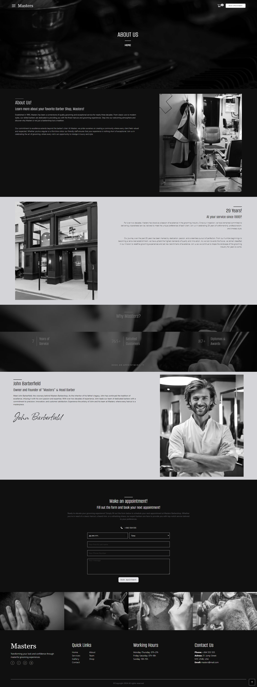
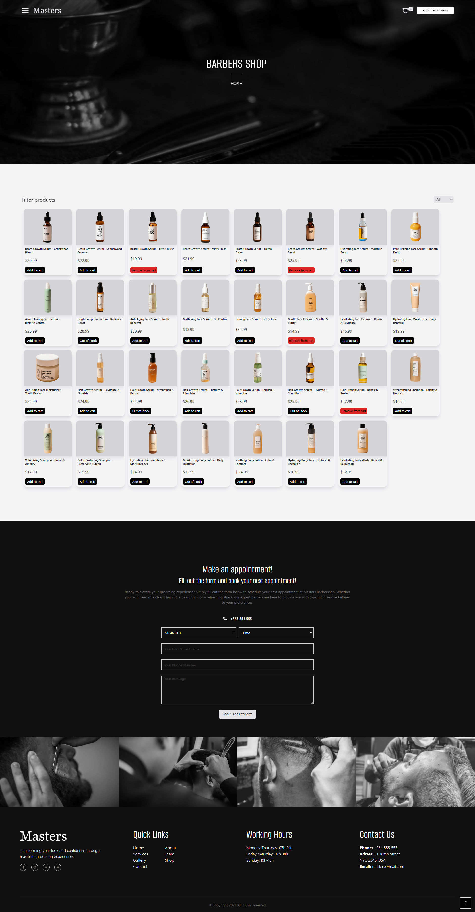
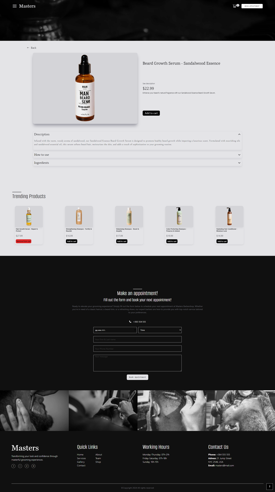
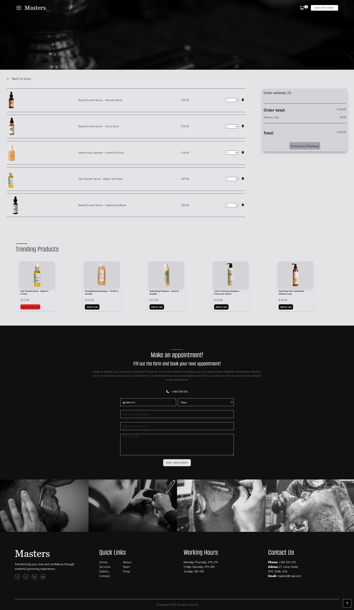
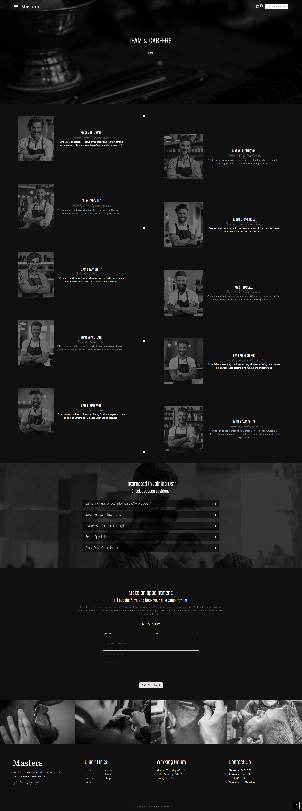
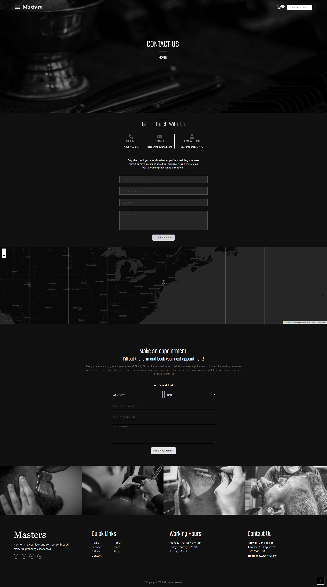

<h1>Barbers-Shop Project</h1>
  <h3>About the project</h3>
  
This project integrates a user-friendly booking form for appointments alongside an e-commerce platform, offering a seamless online experience for scheduling services and purchasing grooming products.

Live Demo: <a href='https://barbers-shop.vercel.app/'>Barbers Shop Demo</a>  
» React JS  
» TailwindCSS

  <h2>Project Screenshots</h2>

<h3 align='center'>Home Page </h3>

<h3 align='center'>About Page</h3>

<h3 align='center'>Shop Page </h3>

<h3 align='center'>Product Page </h3>

<h3 align='center'>Cart Page </h3>

<h3 align='center'>Gallery Page </h3>

<h3 align='center'>Team Page </h3>

<h3 align='center'>Contact Page </h3>

